# Noise Reduction on Crime Suspect Security Camera Photographs
- Final project for CS 469 (Introduction to Digital Image Processing) at UNLV. Taken in the Spring 2025 semester.

This project introduces a lightweight and interpretable noise classification and enhancement framework developed to improve the quality of low-resolution CCTV images.

## Abstract

Security cameras play a critical role in identifying crime suspects. However, many closed-circuit television (CCTV) cameras produce low-quality imagery, which can be difficult to interpret [1], and in some cases, be deemed unacceptable in court [2]. While some law enforcement agencies can afford forensics units for video evidence, many are unable to create and maintain such departments [3]. Technically inclined individuals can use basic noise reduction techniques such as mean or median smoothing, [4] but it is easy to disregard the specific noise characteristics of an image. Deep learning approaches such as convolutional neural networks (CNNs) can find complex noise characteristics [5] but are often computationally expensive. This project presents a unique, lightweight approach for improving CCTV camera image quality using edge detection techniques and the k-nearest neighbors (KNN) algorithm to detect the type of noise and apply a tailored enhancement pipeline.

## Examples

- Below are examples of input images, their predicted noise type, and the final image after the tailored enhancements were applied. 

| Noise Type       | Example 1                                                     | Example 2                                                     | Example 3                                                     |
|------------------|---------------------------------------------------------------|---------------------------------------------------------------|---------------------------------------------------------------|
| Salt-and-Pepper  | 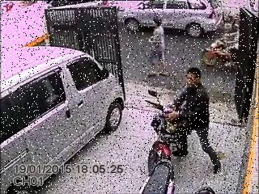<br> | 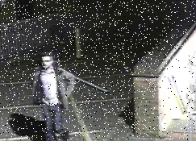<br>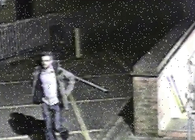 | 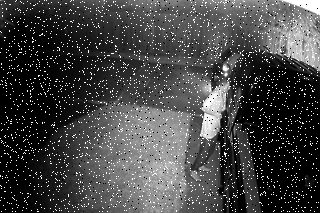<br>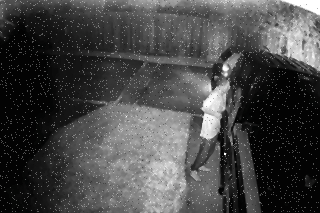 |
| Speckle          | 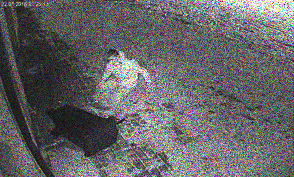<br>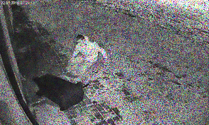 | 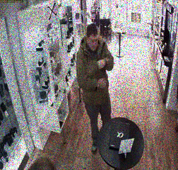<br>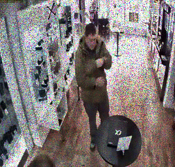 | 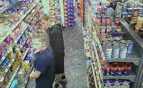<br>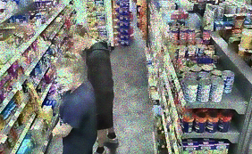 |
| Other            | <br>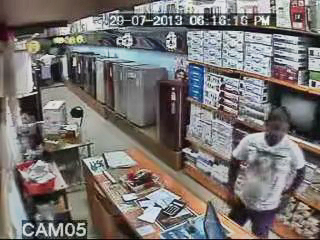 | <br> | 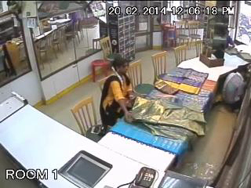<br>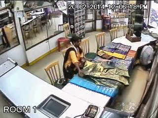 |

## Download

1. Clone the GitHub repository.
```
git clone https://github.com/Ekinn7188/CCTV-Noise-Reduction/
```
2. Install the conda environment.
```
conda env create --name CCTV_Reduction --file environment.yml
```
3. After running the `main.py` script with valid arguments, the rest of the process will automatically complete. 

## Usage

- The installed `data` file comes with a `hog_features.pkl` file, which contains all the training information needed to perform any image detection and enhancement.
- Simple usage:
```
python main.py --image INPUT_IMAGE.png --output OUTPUT_IMAGE.png
```

### Help Screen
```
usage: CCTV Noise Reduction [-h] [--train] [--test] [--image IMAGE] [--output OUTPUT] [--algorithm {saltpepper,speckle,other}]

A targeted noise reduction algorithm for CCTV images.

options:
  -h, --help            show this help message and exit
  --train               Re-run the training on the noise detection model. Defaults to False.
  --test                Run the testing on the noise detection model. Defaults to False.
  --image IMAGE         Path to the image to be processed.
  --output OUTPUT       Path to save the processed image. Defaults to out.png.
  --algorithm {saltpepper,speckle,other}
                        Type of noise to enhance.
```
